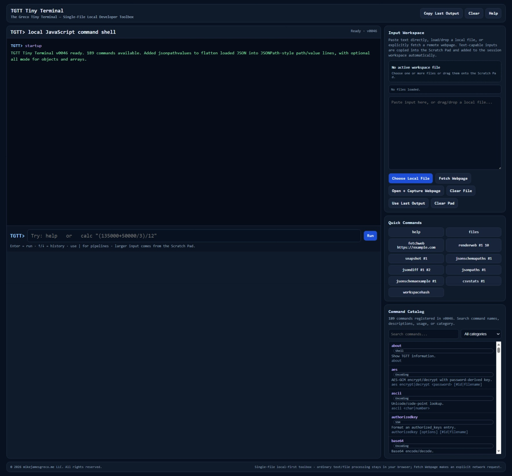

# TGTT Tiny Terminal

**The Greco Tiny Terminal**

A single-file, browser-native developer toolbox with 189 commands for working with text, JSON, XML, CSV, files, web data, encoding, crypto, developer utilities, and more.

TGTT is built as a **Single-File Local Application (SFLA)**. The complete application runs primarily from a single HTML file with no application server, package manager, framework, installation process, or third-party runtime required for normal operation.

Open the file, load local content when needed, and work directly in the browser.

> **A tiny terminal for everyday developer tasks — one HTML file, no setup.**



## Run TGTT

**[▶ Run TGTT in your browser](https://mikejamesgreco.github.io/tgtt-tiny-terminal/)**

No installation is required. The GitHub Pages version runs TGTT directly in your browser, just like opening the standalone `tgtt-tiny-terminal.html` file locally.

Most commands operate entirely in the browser. Commands that intentionally communicate with remote systems, such as `fetchweb`, `fetchjson`, and `fetchtext`, use normal browser networking and security rules.

---

## Why TGTT?

Developers constantly need small utilities:

- Pretty-print JSON
- Inspect XML
- Filter text
- Search logs
- Convert CSV
- Generate UUIDs
- Encode/decode Base64
- Hash content
- Inspect files
- Build SQL snippets
- Compare data
- Fetch web content
- Capture rendered browser pages
- Generate printable command references

Those tasks are often spread across websites, IDE plugins, shell commands, desktop tools, and one-off scripts.

TGTT puts a broad collection of those utilities into one local browser application.

```text
Text / JSON / XML / CSV / Files / URLs
                  │
                  ▼
        ┌─────────────────────┐
        │        TGTT         │
        │ The Greco Tiny      │
        │      Terminal       │
        │                     │
        │  Parse   Transform  │
        │  Search  Inspect    │
        │  Convert Compare    │
        │  Fetch   Capture    │
        └──────────┬──────────┘
                   │
          Output / Scratch Pad
```

---

## Core Principles

TGTT is designed around a few simple principles:

- **Single-file application** — the primary application is one HTML file.
- **Local-first** — local files and text are processed in the browser.
- **Browser-native** — native browser APIs are preferred where practical.
- **Dependency-light** — no framework or package manager is required.
- **Developer-focused** — commands are intended to solve practical day-to-day tasks.
- **Composable** — commands can be chained with pipes where supported.
- **Workspace-aware** — loaded files can be referenced using identifiers such as `#1`.
- **Explicit networking** — commands that access remote resources do so intentionally.
- **No backend required** — TGTT itself does not require an application server.

---

## Getting Started

Open the hosted version or open `tgtt-tiny-terminal.html` locally in a modern browser.

Type:

```text
help
```

to display all commands.

For detailed usage:

```text
help json
help fetchweb
help snapshot
```

To generate a printable reference:

```text
cheatsheet
```

or a category-specific sheet:

```text
cheatsheet JSON
cheatsheet Files
cheatsheet Text
```

---

## Command Model

TGTT behaves like a small command console.

Commands can operate on:

- Inline command arguments
- Scratch Pad text
- Loaded workspace files
- Previous output
- Remote resources, when explicitly requested

Examples:

```text
wrap 50 This is a long line of text that should be wrapped.
```

```text
json pretty #1
```

```text
grep -i error #2
```

```text
jsonpathvalues #1
```

Pipes allow supported commands to be composed:

```text
grep -i error #1 | unique
```

---

## Workspace and Files

TGTT includes an in-memory workspace for loaded files.

Files can be selected through the browser file picker or dragged into the application.

Loaded files receive references such as:

```text
#1
#2
#3
```

Common workspace commands include:

```text
files
inspect #1
clone #1 copy.txt
rename #1 orders-clean.csv
workspaceinfo
concatfiles #1 #2
```

The active file can be used implicitly by many commands when a file argument is optional.

---

## Text Utilities

TGTT includes general-purpose text operations such as:

```text
wrap 80
grep -i warning #1
head 20 #1
tail 20 #1
sort #1
unique #1
regex "\b[A-Z]{3}-\d{4}\b"
replace "old" "new" #1
identifier snake "Customer Order Number"
```

These commands are useful for logs, extracts, configuration files, generated output, and ad hoc developer data.

---

## JSON

TGTT includes a broad JSON toolset.

Examples:

```text
json pretty #1
json minify #1
json validate #1
jsonpaths #1
jsonpathvalues #1
jsonpathvalues #1 all
jsonschema #1
jsonschemapaths #1
flatten #1
```

`jsonpathvalues` produces a flattened JSONPath-style representation:

```text
$.order.number = "700021033"
$.order.status = "BOOKED"
$.order.lines[0].item = "976-7317-001"
$.order.lines[0].quantity = 10
```

This is especially useful for integration payloads and API responses.

---

## XML

TGTT includes XML parsing, formatting, conversion, and schema-related helpers.

Depending on the command, XML can be supplied from the Scratch Pad or loaded workspace files.

TGTT also includes tooling for WADL/XSD-style developer workflows.

---

## CSV

TGTT can inspect, transform, summarize, and convert CSV data.

Examples include:

```text
csvstats #1
csvgroup STATUS #1
csvsort ORDER_DATE desc #1
csv2json #1
json2csv #1
```

CSV commands are intended for lightweight inspection and transformation rather than replacing a full data-grid application.

For larger interactive CSV workflows, see **TGG Grid — The Greco Grid**.

---

## Web Fetching

TGTT includes explicit browser-based networking commands:

```text
fetchweb https://httpbin.org/html
fetchjson https://httpbin.org/json
fetchtext https://httpbin.org/robots.txt
```

Fetched content is placed into TGTT's workspace for further inspection.

Normal browser security rules apply, including:

- CORS
- Authentication cookies
- Redirect handling
- Browser extension behavior
- Site security policies

TGTT does not bypass browser security controls.

---

## Rendered Web Capture

TGTT can open a fetched remote page and capture the rendered browser tab using the browser's user-approved screen/tab capture flow.

Typical workflow:

```text
fetchweb https://httpbin.org/html
renderweb #1 5 "TGTT Public Fetch Test"
```

TGTT opens the remote page in a normal browser tab.

After the page renders:

1. Return to TGTT.
2. Choose **Capture Rendered Tab**.
3. Select the rendered browser tab in the browser picker.
4. TGTT captures the visible rendered page.
5. Snapshot metadata is placed in a dedicated header above the image so webpage content is not covered.

Browser permission is always required for tab capture.

---

## Snapshot

The `snapshot` command creates a self-contained HTML snapshot from a workspace file.

Example:

```text
snapshot #1 project-status
```

For supported content, TGTT can also export visual captures from the generated snapshot.

PDF snapshots use PDF.js rendering support and can render all pages for capture.

---

## Printable Cheat Sheet

TGTT can generate its own command reference directly from the live command registry.

```text
cheatsheet
```

The generated page includes:

- Command category
- Command name
- Expanded description
- Usage syntax
- Practical example
- Print / Save as PDF support

Category-specific sheets can also be generated:

```text
cheatsheet JSON
cheatsheet CSV
cheatsheet Files
```

Because the sheet is generated from the live registry, it remains synchronized with the actual commands available in the current TGTT build.

---

## Recipes

The `recipe` command provides example workflows that combine multiple TGTT commands.

Current recipe topics include:

```text
recipe web-capture
recipe json-api
recipe csv-cleanup
recipe file-compare
```

Recipes are intended as lightweight built-in guidance for common multi-command tasks.

---

## Encoding, Crypto, and Developer Utilities

TGTT includes utilities for common developer operations such as:

```text
uuid
random 1 100
password 20
base64 encode "Hello TGTT"
url encode "customer name=Greco & Sons"
html encode "<div>Example</div>"
hash sha256 "Hello TGTT"
checksum #1
hexdump #1
mime report.json
httpstatus 404
bearer TOKEN_VALUE
```

The command catalog includes many additional developer-focused helpers.

---

## SSH Tooling

TGTT includes local SSH-related helpers for working with SSH configuration and key material.

These commands do **not** establish a direct live TCP SSH connection to port 22 because normal browser JavaScript cannot open arbitrary TCP sockets.

TGTT's SSH support is therefore intended for local generation, inspection, and preparation tasks rather than acting as a full SSH terminal.

---

## Command Catalog

TGTT includes a searchable, categorized command catalog in the UI.

Commands are grouped into categories such as:

- Shell
- Text
- Data
- JSON
- XML
- CSV
- SQL
- HTTP
- Files
- Date & Number
- Encoding
- Crypto
- SSH
- Developer utilities

The exact categories and command inventory may evolve as TGTT grows.

---

## Local-First Architecture

Most TGTT operations happen entirely in the browser.

```text
┌──────────────────── Browser ────────────────────┐
│                                                │
│ File / Text ──► TGTT ──► Transform / Inspect   │
│                   │                            │
│                   ├────► Scratch Pad           │
│                   ├────► Workspace             │
│                   └────► Saved Output          │
│                                                │
└────────────────────────────────────────────────┘
```

Remote networking occurs only when the user explicitly invokes a network-capable command.

---

## Browser Security and CORS

Commands such as `fetchweb`, `fetchjson`, and `fetchtext` use the browser's native `fetch()` implementation.

Normal browser rules therefore apply.

A remote site must permit browser access from the current origin for direct cross-origin requests to succeed.

For controlled internal development environments, browser development tools or extensions may alter CORS behavior. Production systems should use appropriate server-side CORS policies or approved gateways.

---

## Privacy

TGTT is local-first.

Loading a local file does not inherently upload that file to a TGTT server or cloud service.

Users should still consider the behavior of:

- Remote URLs they intentionally fetch
- Browser extensions
- Browser policies
- Screen/tab capture permissions
- External services they explicitly access

when working with sensitive information.

---

## Single-File Local Application (SFLA)

TGTT follows an architecture we refer to as a **Single-File Local Application**, or **SFLA**.

An SFLA is a complete browser application designed to operate primarily from a single self-contained file.

For TGTT this means:

```text
tgtt-tiny-terminal.html
```

contains the application.

No runtime installation is necessary.

The surrounding repository can contain documentation, screenshots, samples, tests, and development resources, but they are not required to run TGTT itself.

---

## Repository Structure

A simple repository structure is recommended:

```text
tgtt-tiny-terminal/
│
├── index.html                 # GitHub Pages launcher
├── tgtt-tiny-terminal.html    # Standalone TGTT application
├── screenshot.jpeg            # Optional screenshot for README
├── README.md
├── CHANGELOG.md
└── LICENSE
```

The exact structure may evolve as the project grows.

---

## Browser Support

TGTT is designed for modern desktop browsers.

Chromium-based browsers such as Microsoft Edge and Google Chrome currently provide the broadest support for browser-native capabilities used by TGTT, including File System Access and screen/tab capture APIs.

Other modern browsers may use fallback behavior where a particular browser API is unavailable.

---

## Project Status

TGTT is under active development.

The application has grown into a broad browser-native developer toolbox with nearly 200 commands.

Current development priorities include:

- Command validation and regression testing
- Practical command documentation
- Additional comparison/data-inspection utilities
- Expanded recipes
- Continued hardening of browser-native file and web workflows

---

## Philosophy

TGTT is intentionally simple.

The objective is not to reproduce a full shell, IDE, or operating-system terminal inside the browser.

The objective is to make a large collection of useful developer utilities immediately available with almost no setup.

```text
No framework.
No package manager.
No application server.
No installation ceremony.

Just a browser, one HTML file, and the task in front of you.
```

---

## License

License information will be added to the repository's `LICENSE` file.

---

## Author

**Michael J. Greco**

TGTT — **The Greco Tiny Terminal**

© mikejamesgreco.me LLC. All rights reserved.
